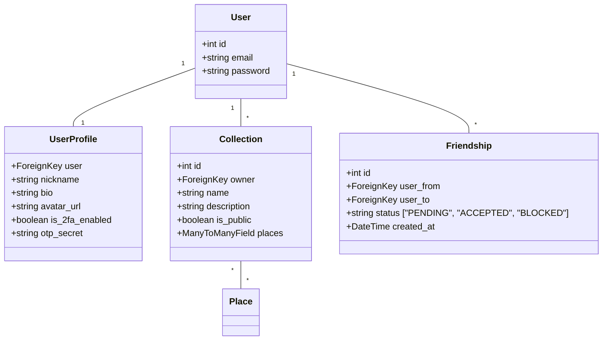

# Product Requirements Document (PRD): Phase 3 - Social Features & User Accounts

## 1. Контекст и Проблема (Context & Problem)
На текущем этапе Walk-Way является изолированным приложением для одного пользователя. Чтобы превратить его в полноценную платформу для прогулок и свиданий, необходимо добавить социальный слой. 

Этот PRD описывает внедрение **системы аккаунтов (JWT)**, **профилей пользователей** с возможностью кастомизации, **персональных коллекций мест (папок)** и **социального графа (друзья)**. Это позволит пользователям делиться любимыми локациями, искать единомышленников с похожими вайбами и планировать совместные маршруты.

---

## 2. Пользовательские истории (User Stories)

### 2.1 Авторизация и Профиль
- **Регистрация/Вход:**
  *Как пользователь, я хочу иметь возможность зарегистрироваться и войти в систему через защищенный JWT-токен, чтобы мои данные, избранные места и друзья сохранялись на любых устройствах.*
  *Как безопасность-ориентированный пользователь, я хочу иметь возможность подключить двухфакторную аутентификацию (TOTP/Email OTP) как опцию, чтобы защитить свой аккаунт.*
- **Кастомизация профиля:**
  *Как городской исследователь, я хочу настроить свой профиль (загрузить фото/аватар, написать био, указать никнейм), чтобы другие пользователи могли узнать о моих интересах и вайбах.*

### 2.2 Коллекции и Папки (Favorites & Collections)
- **Личные папки:**
  *Как любитель кофе, я хочу сохранять места по папкам (например, "Тихий кофе", "Шумные бары", "Парки для книг"), чтобы структурировать свои любимые локации.*
- **Менеджмент папок:**
  *Как пользователь, я хочу создавать, переименовывать и удалять папки, а также добавлять/удалять из них места в один клик прямо из карточки места.*

### 2.3 Социальное взаимодействие (Друзья)
- **Поиск единомышленников:**
  *Как пользователь, я хочу искать других людей по их никнеймам, чтобы добавлять друзей.*
- **Просмотр профилей друзей:**
  *Как друг, я хочу зайти в профиль своего друга, увидеть его публичные коллекции мест и любимые прогулочные вайбы, чтобы найти общие интересы.*
- **Запросы в друзья:**
  *Как общительный человек, я хочу отправлять запросы в друзья и получать интерактивные уведомления о входящих запросах.*

---

## 3. Функциональные требования (Functional Requirements)

### 3.1 Архитектура Базы Данных (Django Models)

- **UserProfile:** Расширение стандартной модели пользователя (OneToOneField). Содержит `nickname` (уникальный), `bio` (до 500 символов), `avatar` (ImageField с загрузкой в Cloud/Local storage), а также поля для опционального 2FA (TOTP secret, `is_2fa_enabled`).
- **Collection:** Модель папки. Атрибуты: `name`, `description`, `owner` (ForeignKey на User), `is_public` (boolean, позволяет делать папку приватной или видимой для друзей), `places` (ManyToManyField на `Place`).
- **Friendship:** Модель дружбы. Поля: `user_from`, `user_to`, `status` (Enum: PENDING, ACCEPTED, BLOCKED), `created_at`. Уникальный индекс на пару пользователей.

### 3.2 Backend API (REST Эндпоинты)
- **Аутентификация (`/api/v1/auth/`):**
  - `POST /register/` — создание пользователя и профиля.
  - `POST /login/` — выдача JWT Access/Refresh токенов (и запрос OTP, если 2FA включена).
  - `POST /refresh/` — обновление Access токена по Refresh токену.
  - `POST /2fa/enable/` и `POST /2fa/verify/` — включение и валидация 2FA.
- **Профили (`/api/v1/profiles/`):**
  - `GET /me/` — получить профиль текущего юзера.
  - `PATCH /me/` — обновить профиль (включая загрузку аватара через `multipart/form-data`).
  - `GET /{nickname}/` — публичный профиль другого пользователя (если они друзья).
- **Коллекции (`/api/v1/collections/`):**
  - `GET /` — список коллекций текущего пользователя (с подсчетом мест).
  - `POST /` — создать коллекцию.
  - `DELETE /{id}/` — удалить коллекцию.
  - `POST /{id}/add-place/` и `POST /{id}/remove-place/` — добавление/удаление мест.
- **Друзья (`/api/v1/friends/`):**
  - `GET /` — список принятых друзей.
  - `GET /requests/` — входящие/исходящие запросы в друзья.
  - `POST /request/` — отправить запрос (`to_user_id`).
  - `POST /respond/` — принять или отклонить запрос (`friendship_id`, action: accept/decline).
  - `POST /block/` — заблокировать пользователя.

### 3.3 Frontend (Next.js UI & Zustand)
- **Auth Page:** Красивая glassmorphic форма входа/регистрации (соответствующая `DESIGN.md`).
- **Profile Dashboard (`/profile`):**
  - Отображение аватара, никнейма, био, вкладки "Мои папки", "Мои друзья".
  - Режим редактирования (модальное окно с кропом аватара и формой изменения био).
- **Менеджер Коллекций:**
  - При нажатии кнопки "Сохранить" на карточке места в Explore/Map открывается всплывающее окно (Dropdown/Modal) со списком папок пользователя и чекбоксами (место можно добавить сразу в несколько папок).
  - Кнопка "Создать новую папку" прямо из этого Dropdown.
- **Friends Panel:**
  - Поиск пользователей по нику.
  - Вкладка "Запросы" с бейджами (счетчик входящих запросов).
  - Переход на профили друзей: `/profile/{nickname}` с просмотром их публичных папок и возможностью построить маршрут по их любимым местам.

---

## 4. Нефункциональные требования (Non-Functional Requirements)

- **Безопасность (Security):**
  - Хранение паролей через Argon2/BCrypt (стандарт Django).
  - Срок действия Access-токена — 15 минут, Refresh-токена — 7 дней.
  - Защита эндпоинтов авторизации от брутфорса (Rate Limiting).
- **Оптимизация загрузок (Media Optimization):**
  - Автоматическое сжатие и ресайз загружаемых аватаров на бэкенде до разрешения $400 \times 400$ пикселей (в формате WebP/JPEG) перед сохранением на диск.
- **Производительность:**
  - Запросы к списку друзей и коллекциям должны выполняться с использованием `select_related` и `prefetch_related` в Django для исключения проблемы $N+1$.

---

## 5. Edge Cases & Error Handling (Крайние случаи)

- **Конфликт удаления папки:**
  *Что произойдет, если пользователь удалит папку, места из которой в данный момент добавлены в активный маршрут?*
  *Решение:* Активный маршрут хранится в клиентском Zustand-сторе и не зависит жестко от папок бэкенда в реальном времени. Удаление папки на бэкенде никак не сбрасывает активную прогулку.
- **Превышение лимитов:**
  *Ограничение на размер загружаемого аватара.*
  *Решение:* Валидация на фронтенде (ограничение в 5MB) и бэкенде. При превышении выводится понятный Toast: *"Файл слишком большой. Максимальный размер — 5 МБ"*.
- **Потеря OTP секрета:**
  *Если пользователь потерял доступ к Authenticator при включенной 2FA.*
  *Решение:* Выдача 5 резервных одноразовых кодов восстановления (Backup Codes) при активации 2FA, которые необходимо сохранить.

---

## 6. Критерии приемки (Acceptance Criteria / Definition of Done)

- [ ] Реализованы защищенные эндпоинты регистрации и JWT-авторизации (SimpleJWT).
- [ ] Опциональное включение 2FA (TOTP) работает: бэкенд генерирует QR-код/секрет, фронтенд запрашивает 6-значный код при входе.
- [ ] Профиль пользователя успешно редактируется: никнейм уникален, био обновляется, аватар сжимается и загружается.
- [ ] Пользователь может создавать коллекции (папки), делать их публичными/приватными и добавлять/удалять из них места.
- [ ] Социальный граф работает: можно отправить запрос в друзья, принять его, увидеть список друзей.
- [ ] При переходе на профиль друга `/profile/{nickname}` отображаются его публичные коллекции, и места из них можно добавить в свой активный маршрут.
- [ ] Код покрыт юнит/интеграционными тестами (минимум 80% покрытия для auth, collections, friends).
